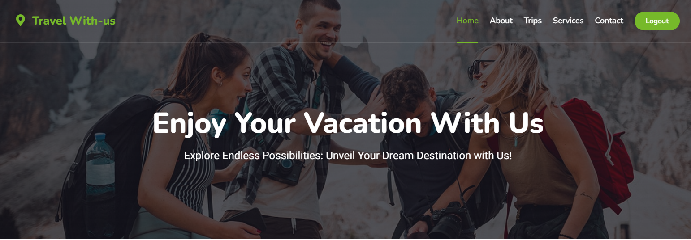
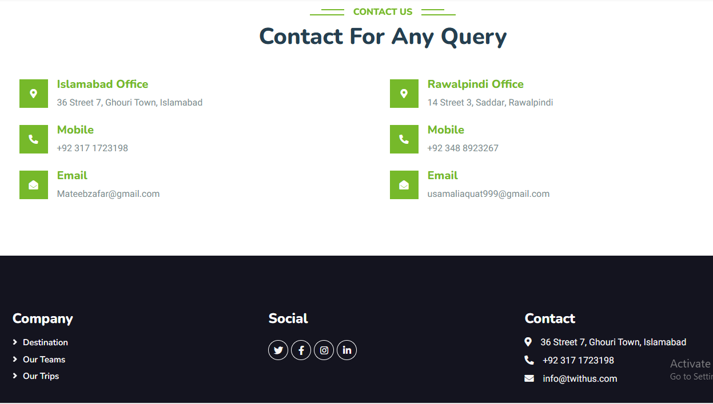
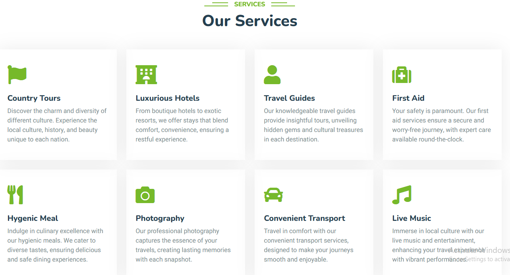

# 🌍 Travel With Us — Full Stack Web Application

### Live Application
Check out the deployed app here: [Travel With Us](https://travelwithusfyp.netlify.app/)

---

## Description
**Travel With Us** is a full-stack web application developed using **React** for the frontend and **Node.js with Express** for the backend, with **MySQL** as the relational database. 

The application allows users to explore and manage travel bookings securely while providing administrators with full control over the platform via a centralized dashboard. It features **user authentication**, **role-based access control**, and a **responsive interface**, ensuring seamless interaction across devices. This project demonstrates a complete end-to-end full stack workflow, from frontend UI to backend APIs and database integration.

---

## Screenshots

### Home Page


### Login Page


### About Page


### Services Page


> Ensure screenshots are saved in the `images/` directory and committed to GitHub.

---

## Features

### User Features
- User registration and login with secure authentication
- Browse available travel options
- Create and manage travel bookings
- Update or cancel personal bookings
- View booking history
- Fully responsive interface for desktop and mobile

### Admin Features
- Role-based admin access
- View all user bookings
- Update or delete any booking
- Centralized dashboard for managing bookings
- Monitor system activity

### Backend & Security
- RESTful API built with Express.js
- Role-based authentication and authorization
- MySQL database for persistent storage
- Full CRUD (Create, Read, Update, Delete) functionality
- Secure password handling
- Structured API responses and error handling

### Frontend & UI
- React-based Single Page Application (SPA)
- Component-driven architecture
- Responsive UI using Bootstrap
- API integration using Axios

---

## Tech Stack
- **Frontend:** React, Bootstrap, HTML5, CSS3, JavaScript
- **Backend:** Node.js, Express.js
- **Database:** MySQL
- **Authentication & Security:** JWT or session-based auth, password hashing
- **Deployment:** Netlify (frontend) / any cloud provider (backend)

---

## Installation & Local Setup

### Prerequisites
- Node.js and npm installed
- MySQL database
- Git

### Clone the Repository
```bash
git clone https://github.com/Usama112222/Travel-With-Us-Full-Stack-Web-Application.git
cd Travel-With-Us-Full-Stack-Web-Application
Frontend Setup
cd client
npm install
npm start
# Runs on http://localhost:3000
Backend Setup
cd server
npm install
node index.js
# Runs on http://localhost:5000
Database Setup
CREATE DATABASE travel_with_us;
Update your backend config with database credentials.

Future Enhancements
Role-based access with JWT

Admin analytics dashboard

Payment integration for bookings

Dockerized deployment

Automated testing for frontend and backend

Author
Usama Liaqat

License
This project is licensed under the MIT License.


---

## ✅ **Step 5: Stage, commit, and push**

Once all conflicts are removed:

```bash
git add README.md images/home.png
git commit -m "Resolve merge conflicts and add screenshots"
git push origin main